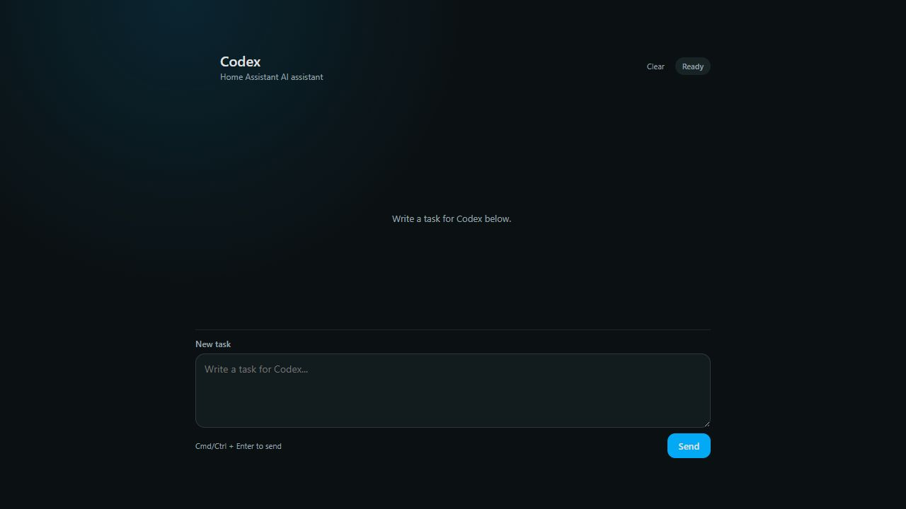
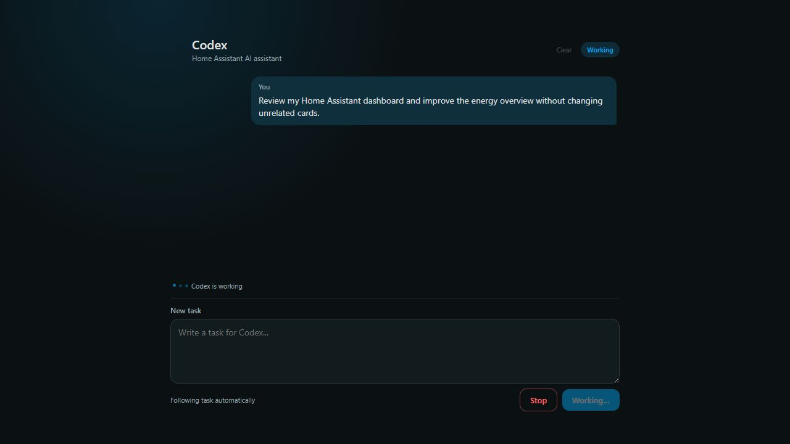
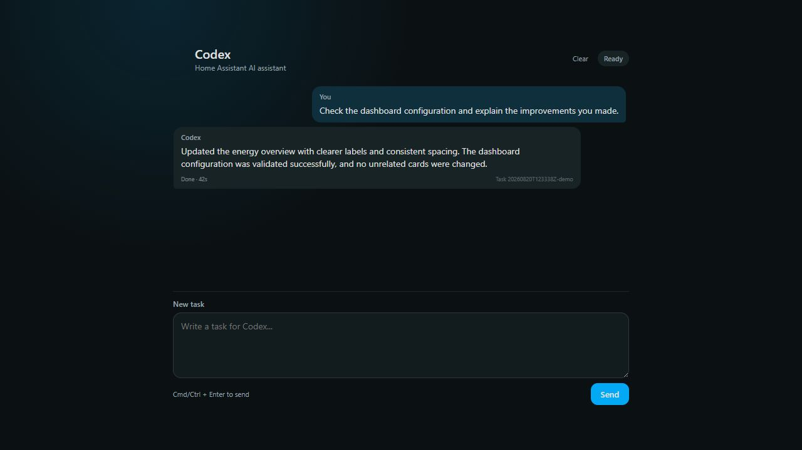

# Home Assistant Codex Card

A standalone Lovelace chat card for the [Home Assistant Codex CLI Worker integration](https://github.com/moryoav/home-assistant-codex).

The card gives you a direct Codex task interface inside a Home Assistant dashboard while keeping the worker and integration unchanged.

## Screenshots

Ready for a new task:



Following an active Codex task:



Completed task with the full result:



## Features

- Start Codex tasks directly from Lovelace.
- Follow queued, starting, and running tasks automatically.
- Restore an in-progress task after a dashboard or frontend reload.
- Display full task details and summaries.
- Reply when Codex needs user input.
- Stop active tasks.
- Clear the local conversation without deleting worker tasks.
- Retry temporary polling failures.
- Preserve the latest conversation locally in the browser.
- Use Home Assistant theme variables with a responsive layout.
- No external JavaScript dependencies.

## Requirements

Install and configure the worker and integration from:

- [moryoav/home-assistant-codex](https://github.com/moryoav/home-assistant-codex)

This repository contains only the optional dashboard card. It does not include or replace the worker or integration.

## Installation

1. Download [`codex-prompt-card.js`](codex-prompt-card.js).
2. Copy it to:

   ```text
   /config/www/codex-prompt-card.js
   ```

3. In Home Assistant, open **Settings → Dashboards**.
4. Open the top-right menu and select **Resources**.
5. Add the following as a **JavaScript module**:

   ```text
   /local/codex-prompt-card.js?v=1
   ```

6. Add the card to a dashboard:

   ```yaml
   type: custom:codex-prompt-card
   ```

For a dedicated full-screen chat, create a Home Assistant **Panel** view and
enable the card's full-height layout:

```yaml
type: custom:codex-prompt-card
full_height: true
```

The header and composer remain visible while the conversation uses the
remaining screen height and scrolls independently. Leave `full_height` out (or
set it to `false`) when the card shares a view with other cards.

## Updating

Replace `/config/www/codex-prompt-card.js` with the new version, then increment the resource query value, for example:

```text
/local/codex-prompt-card.js?v=2
```

Incrementing the value prevents Home Assistant and the browser from continuing to use an older cached copy. A Home Assistant restart is not required.

## Task restoration

After a frontend reload, task states are restored explicitly:

- `queued`, `starting`, `running`: Working mode and polling resume.
- `needs_input`, `waiting`, `waiting_for_input`, `question`: Waiting/Reply mode.
- `completed`: final details or summary.
- `cancelled`, `canceled`: cancelled result.
- `failed`, `error`: error result.
- Unknown states are shown as errors and are never treated as completed.

## Clear and Stop

**Clear** resets only this card's locally stored conversation and remembered task. It does not cancel or delete work in the Codex worker.

**Stop** requests cancellation of the active worker task.

## Security

Codex can modify Home Assistant configuration when the worker has permission to do so. Review prompts and results carefully, keep backups, and test changes safely.

## License

MIT
